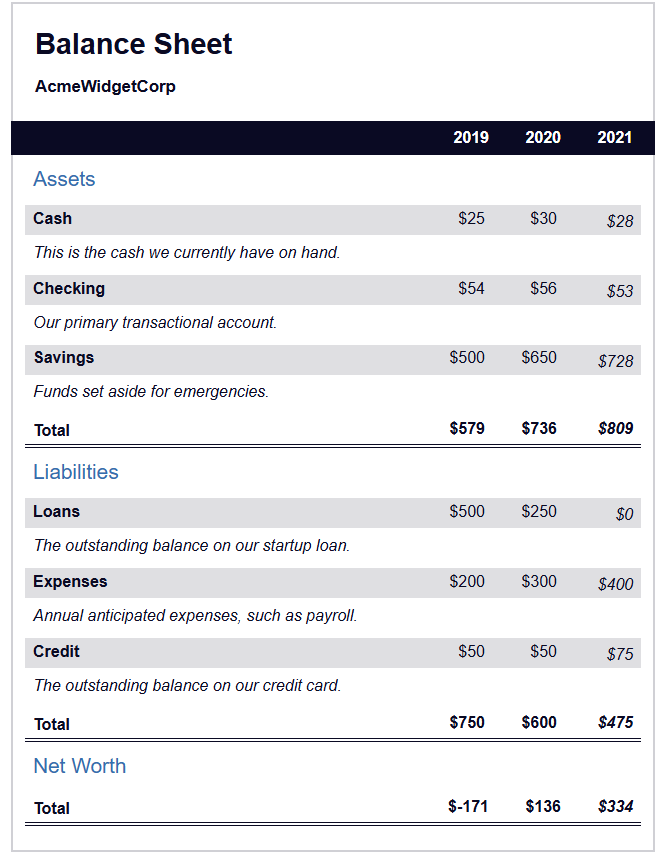

# Learn More About CSS Pseudo Selector by Building a Quiz

The task list link is [FreeCampCode a Balance Sheet](https://www.freecodecamp.org/learn/2022/responsive-web-design/learn-more-about-css-pseudo-selectors-by-building-a-balance-sheet/step-1)

The task screen shot;

